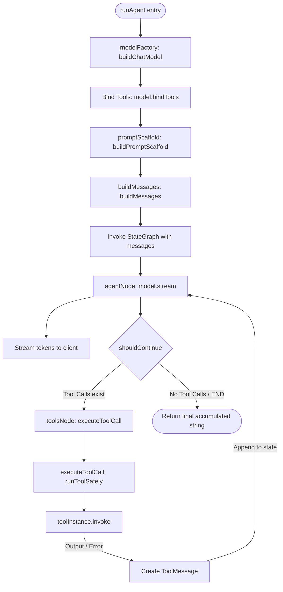

# AgentCore Technical Documentation (Agent-Only)

This document provides a deep technical dive into the **AgentCore** engine located in `api/src/agent/`. It explains the state management, the execution graph, prompt construction, attachment handling, and tool execution lifecycle.

---

## 1. Core Execution Pipeline

The agent operates as a state machine using **LangGraph**. When the backend receives a message, it transfers control to the agent's graph, which runs a cycle of model invocations and tool executions until a final response is generated.



---

## 2. File-by-File Breakdown & Technical Details

### A. Model Factory (`modelFactory.ts`)
Creates a standard LangChain `BaseChatModel` wrapper depending on the configured LLM provider.
* **Provider support**: Handles `"gemini"` (`ChatGoogleGenerativeAI`) and `"openai"` (`ChatOpenAI`) or custom OpenAI-compatible APIs (like OpenRouter).
* **Streaming**: Enables `streaming: true` across all models so that responses are received block-by-block.

---

### B. Prompt Scaffolding (`promptScaffold.ts`)
Prepends a structured system scaffold to the user's custom system prompt. This enforces a consistent behavioral framework for the agent:
1. **Planning**: Requires the agent to invoke the `update_plan` tool before beginning complex workflows.
2. **Iterative updates**: Requires updating the plan's status checkboxes (`pending`, `in_progress`, `done`) step-by-step.
3. **Sandbox filesystem usage**: Instructs the agent to utilize its private scoped directory to store intermediate results, drafts, and notes.
4. **Persistent User Memory**: Automatically checks for any persistent memories saved for the current user and formats them into the system prompt. This informs the model of user preferences (like programming language or working directories) across all chat sessions.

---

### C. Message History & Multimodal Attachments (`buildMessages.ts`)
Converts the database history array (`ChatHistoryItem[]`) into LangChain `BaseMessage` components.
* **Text Attachments**: Text files, JSON files, and source code files (`.ts`, `.tsx`, `.js`, `.jsx`) are loaded off the disk, formatted into text blocks, and appended to the user prompt context:
  ```markdown
  --- Attachment: filename.ts ---
  [content of the file]
  --------------------------------
  ```
* **Image Attachments**: Images are read from the server storage, converted to base64, and injected into the message context as multimodal blocks:
  ```json
  {
    "type": "image_url",
    "image_url": { "url": "data:image/jpeg;base64,..." }
  }
  ```

---

### D. The LangGraph Orchestrator (`runAgent.ts`)
This is the core engine of the agent. It sets up the execution loop using LangGraph's `StateGraph`.

1. **State**: The graph is stateful and uses `MessagesAnnotation` to maintain the conversation history during the turn.
2. **Nodes**:
   * **`agentNode`**: Invokes the LLM model with the current messages state. It reads the model's response using `model.stream(state.messages)` and calls `params.onToken(token)` to stream tokens immediately back to the client. It aggregates the chunks into a final `AIMessage` and appends it to the graph state.
   * **`toolsNode`**: Inspects the last `AIMessage` for `tool_calls`. For every requested tool, it broadcasts a client notification (e.g. `*[Calling tool: get_weather...]*`) and calls `executeToolCall(toolCall)` to execute it, returning `ToolMessage` instances back to the graph.
3. **Conditional Edges**:
   * **`shouldContinue`**: Runs after `agentNode` finishes. If the model generated `tool_calls`, it routes execution to `toolsNode`. Otherwise, it routes to `END` and returns the gathered text.
4. **Recursion Guard**:
   * `recursionLimit` is set to `MAX_AGENT_STEPS * 2 + 1` (defaulting to 17 steps). If the agent runs into a tool execution loop, the graph throws a `GraphRecursionError`, logs a warning, and gracefully notifies the user to rephrase their request instead of crashing.

---

### E. Safe Tool Runner (`executeToolCall.ts`)
Responsible for running a single tool invocation safely.
* **Critical Requirement**: LLM providers require that *every* tool call generated by the model receives exactly one corresponding `ToolMessage` in response. If a tool call throws an unhandled error or validation exception, and no message is sent back, the next model request will fail.
* **Safety Wrap**: `executeToolCall` wraps execution in a try/catch. If a tool fails (e.g., arguments are missing, filesystem is full, API is offline), the error message is caught and returned inside the `ToolMessage` content so the LLM is notified of the issue and can decide how to recover:
  ```typescript
  try {
    return await toolInstance.invoke(toolCall.args);
  } catch (err) {
    return `Error: tool call failed - ${err instanceof Error ? err.message : err}`;
  }
  ```

---

### F. Tools & Features (`tools.ts`, `planningTool.ts`, `sandboxTools.ts`)
The agent binds multiple tools:

1. **Planning Tool (`update_plan`)**:
   * Converts the list of tasks provided by the model into a Markdown checklist: `plan.md`.
   - Renders a checkbox symbol: `✓` for completed tasks, `→` for in-progress tasks, and `○` for pending tasks.
   - Saves it to the conversation's sandbox directory on disk.

2. **Sandbox File Tools (`read_file`, `write_file`, `list_files`)**:
   - Gives the LLM read/write access to the conversation sandbox.
   - Uses `resolveSandboxPath` to prevent path traversal attacks (preventing the model from accessing folders like `/etc`, `/var`, or files outside the active sandbox).

3. **Background scheduler (`schedule_command`, `list_scheduled_tasks`, `cancel_scheduled_task`)**:
   - Schedules background system commands to execute on the host machine.
   - Pushes jobs to BullMQ (Redis-backed queue), allowing delayed or recurring (cron-based) execution.

4. **Persistent User Memory (`save_memory`, `delete_memory`)**:
   - **`save_memory`**: Enters a new preference or fact about the user (e.g. name, directory settings, development framework) into the `Memory` database collection.
   - **`delete_memory`**: Deletes a specific memory from the database using its ID so it will not be injected into future turns.
   - *Note*: Users can also view, add, and delete these memories manually via the **Memory** management dashboard on the frontend (`/memory`).

5. **Information Helpers**:
   - `get_time`: Returns current system date and time.
   - `get_weather`: Contacts `wttr.in` for live weather reports.
   - `web_search`: Queries DuckDuckGo and parses HTML to extract top snippet results.
   - `tell_joke`: Retrieves a random joke from a list.

---

## 3. The Execution Lifecycle: Multi-Turn Loop

To illustrate how these modules coordinate, here is a lifecycle step-by-step trace:

```
  Step 1: User Message
    └─► HumanMessage is created with user input & file attachments.
  
  Step 2: Initialize Graph
    └─► LangGraph is invoked with [SystemMessage, HumanMessage].
  
  Step 3: AgentNode Execution
    └─► model.stream() is invoked.
    └─► Tokens stream to the client (updating the UI in real-time).
    └─► Model requests tool execution: write_file("notes.txt", "Hello World").
  
  Step 4: shouldContinue Routing
    └─► shouldContinue checks AIMessage -> detects tool call -> routes to "tools" node.
  
  Step 5: ToolsNode Execution
    └─► formatToolCallAnnouncement sends notice: "*[Calling tool: write_file...]*".
    └─► executeToolCall runs write_file tool safely.
    └─► Sandbox path is checked and written to conversation sandbox.
    └─► ToolMessage is returned and stored in Graph State.
  
  Step 6: AgentNode Execution (Turn 2)
    └─► model.stream() runs again with [..., ToolMessage].
    └─► LLM sees that the file was written successfully.
    └─► Responds with text: "I have successfully written 'Hello World' to notes.txt."
  
  Step 7: shouldContinue Routing (Turn 2)
    └─► shouldContinue checks AIMessage -> no tool call detected -> routes to END.
  
  Step 8: Final Return
    └─► Graph execution finishes.
    └─► Final response is saved to MongoDB and SSE stream is closed.
```
