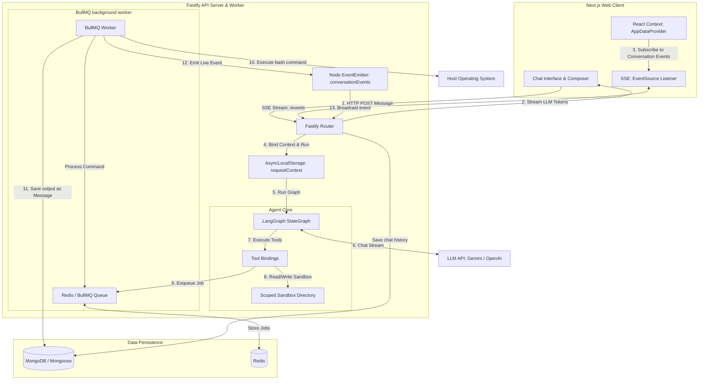

# AgentNano Technical Documentation

This document provides a comprehensive overview of the **AgentNano** architecture, its components, tools, execution flow, and background task scheduling mechanism.

---

## 1. System Architecture Overview

AgentNano is a full-stack, AI-agent platform that supports multi-turn conversations, code execution sandbox tools, and background task scheduling (one-off and repeating cron jobs) with real-time updates.



---

## 2. Directory Structure

The project is structured as a monorepo containing two primary folders: `api` (the backend server/worker) and `web` (the Next.js client).

```
/var/www/skarbol/agent/apps
├── api/                           # Fastify Backend & Worker
│   ├── src/
│   │   ├── agent/                 # Core LangGraph agent and tools
│   │   │   ├── runAgent.ts        # LangGraph StateGraph engine
│   │   │   ├── buildMessages.ts   # History formatter for LLM
│   │   │   ├── executeToolCall.ts # Safe tool execution wrappers
│   │   │   ├── modelFactory.ts    # Model construction (OpenAI, Gemini)
│   │   │   ├── planningTool.ts    # update_plan tool implementation
│   │   │   ├── sandboxTools.ts    # read_file, write_file, list_files
│   │   │   ├── tools.ts           # Tool definitions & exports
│   │   │   └── types.ts           # Agent type declarations
│   │   ├── config/                # Environment configuration
│   │   ├── db/                    # Mongoose Models (User, Message, etc.)
│   │   ├── middleware/            # Fastify Middleware (authenticate)
│   │   ├── routes/                # API Endpoints (Fastify)
│   │   │   ├── conversations.ts   # Chat messages & SSE event streaming
│   │   │   └── scheduled-tasks.ts # Background job control
│   │   ├── services/              # Business Logic Services
│   │   │   ├── conversation/      # sendMessage, loadRecentMessages, history
│   │   │   └── schedule/          # BullMQ queue connection, worker setup
│   │   ├── utils/                 # Utilities (AsyncLocalStorage context, logger)
│   │   └── index.ts               # Node process entry point
│   ├── package.json
│   └── tsconfig.json
│
└── web/                           # Next.js Frontend Client
    ├── src/
    │   ├── app/                   # Next.js App Router (chat, configure, tasks)
    │   ├── components/            # UI components (dashboard, message items)
    │   └── lib/                   # API bindings & AppDataContext (state)
    ├── package.json
    └── tailwind.config.ts
```

---

## 3. Core Component Analysis

### A. Frontend Real-Time & Streaming Architecture
The web UI is a responsive Next.js application that leverages standard CSS/Tailwind details. State management is encapsulated in a central React Context provider: [app-data.tsx](file:///var/www/skarbol/agent/apps/web/src/lib/app-data.tsx).

1. **Token Streaming (POST Response)**
   - When a user submits a query, the composer performs a standard HTTP POST request to `/api/conversations/:id/messages`.
   - The response is hijacked as a `text/event-stream`.
   - The React controller reads the streaming body chunk-by-chunk using a `ReadableStreamDefaultReader` and decodes it:
     - **`user_message` event**: Appends the user's message to the state and generates a placeholder assistant message with a temporary ID.
     - **`token` event**: Appends incoming text tokens to the placeholder assistant message.
     - **`done` event**: Replaces the placeholder message with the final, serialized Mongoose message object stored in the database.

2. **Background Event Polling (SSE EventSource)**
   - To capture asynchronous updates (such as the output of background-scheduled commands), the conversation page ([page.tsx](file:///var/www/skarbol/agent/apps/web/src/app/%28dashboard%29/chat/%5Bid%5D/page.tsx)) subscribes to an SSE endpoint:
     ```typescript
     const source = new EventSource(`/api/conversations/${params.id}/events`);
     source.onmessage = (event) => {
       const payload = JSON.parse(event.data);
       if (payload.type === "message") {
         receiveMessage(params.id, payload.message);
       }
     };
     ```
   - This ensures background command outputs are immediately integrated into the active conversation timeline without manual page refreshes.

---

### B. Backend Request Hijacking & SSE Events
Fastify routes use response hijacking to manage SSE channels. Inside [conversations.ts](file:///var/www/skarbol/agent/apps/api/src/routes/conversations.ts):

- **`/api/conversations/:id/events`**:
  Hijacks the connection to provide a persistent pipeline. It hooks into a Node.js `EventEmitter` (`conversationEvents`):
  ```typescript
  reply.hijack();
  reply.raw.writeHead(200, {
    "Content-Type": "text/event-stream",
    "Cache-Control": "no-cache, no-transform",
    Connection: "keep-alive",
  });
  reply.raw.write(": connected\n\n");
  
  const onMessage = (message: unknown) => {
    reply.raw.write(`data: ${JSON.stringify({ type: "message", message })}\n\n`);
  };
  conversationEvents.on(id, onMessage);
  ```
  This is highly efficient since both the worker and server run within the same Node process.

---

### C. The Agent Logic (LangGraph StateGraph)
The agent runtime is managed in [runAgent.ts](file:///var/www/skarbol/agent/apps/api/src/agent/runAgent.ts) using `@langchain/langgraph`. It implements a simple state machine:

```
    START
      │
      ▼
┌───────────┐
│   agent   │◄──────────┐
└─────┬─────┘           │
      │                 │ (shouldContinue)
      │                 │
      ├───[Tool Calls?]─┘
      │      Yes
      │
      ▼ No
     END
```

- **`agent` node**: Invokes the LLM with the accumulated messages. It streams tokens character-by-character back to the client using `model.stream(...)`.
- **`tools` node**: Invokes tools in parallel for any `tool_calls` generated by the model. It writes announcements to the stream (e.g., `[Calling tool: ... ]`) and executes the tools.
- **State and Limiters**:
  - State uses LangGraph's `MessagesAnnotation` to accumulate chat logs.
  - Reentrancy is capped via `MAX_AGENT_STEPS = 8` (which resolves to `MAX_AGENT_STEPS * 2 + 1` graph steps) to protect against infinite tool-calling loops.

---

### D. System Scaffolding & Structured Planning
Before invoking the model, `buildPromptScaffold` ([promptScaffold.ts](file:///var/www/skarbol/agent/apps/api/src/agent/promptScaffold.ts)) prefixes the developer's system instructions with a set of operational guidelines:
1. **Plan First**: Always run `update_plan` prior to carrying out complex multi-step instructions.
2. **Step-by-Step Execution**: Update task status icons (`pending → in_progress → done`) systematically.
3. **Private Sandbox**: Utilize the sandboxed directory to save notes, intermediate results, and output files.

The **`update_plan`** tool ([planningTool.ts](file:///var/www/skarbol/agent/apps/api/src/agent/planningTool.ts)) saves a formatted `plan.md` file in the conversation's sandboxed folder:
* **`✓`** represents completed tasks (`status: "done"`).
* **`→`** represents current actions (`status: "in_progress"`).
* **`○`** represents pending items (`status: "pending"`).

---

### E. Sandboxed Filesystem
The filesytem tools (`read_file`, `write_file`, `list_files`) inside [sandboxTools.ts](file:///var/www/skarbol/agent/apps/api/src/agent/sandboxTools.ts) read and write files under a dedicated directory scoped per conversation.
- The path is resolved via `resolveSandboxPath(sandboxDir, filePath)` to prevent path traversal vulnerability (ensuring the agent cannot read files outside its designated directory).
- Users' chat attachments (images, script uploads) are written directly to this directory, making them automatically accessible to the agent.

---

## 4. Background Command Execution & Scheduling

The scheduling architecture uses **BullMQ** backed by **Redis** to execute system shell commands asynchronously:

```
[Agent Tool] ──(enqueue)──► [BullMQ Redis Queue] ──(fetch)──► [BullMQ Background Worker]
                                                                     │
                                                               (execAsync)
                                                                     │
                                                                     ▼
[Client UI] ◄──(SSE Event)◄── [EventEmitter] ◄──(write)────── [Host Operating System]
                                     │
                                     └──────────────────────► [MongoDB Message Document]
```

1. **Scheduling**:
   The `schedule_command` tool ([tools.ts](file:///var/www/skarbol/agent/apps/api/src/agent/tools.ts)) checks the context store (`requestContext.getStore()`) to confirm the active `conversationId` and `userId`.
   - **One-off jobs**: Queued via `commandQueue.add` with a `delay` parameter.
   - **Repeating jobs**: Registered via `commandQueue.upsertJobScheduler` with a `cron` expression.

2. **Execution**:
   The worker ([worker.ts](file:///var/www/skarbol/agent/apps/api/src/services/schedule/worker.ts)) picks up the job, executes the shell command in a shell subprocess using `promisify(exec)`, and intercepts stdout/stderr.

3. **Insertion & Broadcast**:
   - The worker formats the output prefixing it with a special marker: `**[Scheduled Command Executed]**`.
   - It inserts a new message document into MongoDB with `role: "assistant"`.
   - It fires `emitConversationMessage(conversationId, message)`.
   - The active HTTP SSE listener catches the event and pushes it to the browser's `EventSource` subscriber.

---

## 5. History Re-construction & Anti-Hallucination

If scheduled background tasks execute, the model needs to see their outputs to understand what happened. However, if the agent sees that *it* wrote the command execution results (since the worker wrote the output as an `assistant` message in the DB), it might hallucinate command results in a loop or think it already did the work.

To prevent this, AgentNano implements a **History Sanitization** mechanism in [history.ts](file:///var/www/skarbol/agent/apps/api/src/services/conversation/history.ts):

```typescript
export async function buildAgentHistory(
  conversationId: string,
  messages: { _id: unknown; role: string; content: string }[]
): Promise<ChatHistoryItem[]> {
  // ...
  return messages.map((m) => {
    const isScheduledCommand = m.role === "assistant" && m.content.startsWith("**[Scheduled Command Executed]**");
    
    // Defensive: strip the scheduled command marker if it was appended to normal messages
    const content = m.role === "assistant" && !isScheduledCommand
        ? stripTrailingScheduledCommandMarker(m.content)
        : m.content;

    return {
      role: isScheduledCommand ? "system" : (m.role as "user" | "assistant"),
      content: isScheduledCommand 
        ? `[Background System Notification: The following scheduled command was executed automatically]\n${content}` 
        : content,
      // ...
    };
  });
}
```

### Why this is critical:
* **Role Conversion**: Changing `assistant` -> `system` role reframes the shell output as an external prompt notification rather than the agent's own past statement.
* **Prevents Hallucinations**: It stops the agent from getting stuck in loops trying to parse or repeat its own outputs, keeping the conversation context aligned.

---

## 6. Sequence of Operations: End-to-End Traces

### Trace A: User submits a chat message and the agent streams back
1. **User interaction**: User types `"what is the weather in Paris?"` and clicks send.
2. **Client**: Post request containing the input to `/api/conversations/:id/messages`.
3. **Backend API**:
   - Authenticates user.
   - Loads the past 39 messages from MongoDB.
   - Inserts the new human message.
   - Calls `buildAgentHistory` to prepare the array of LangChain messages.
   - Hijacks response stream and sends `user_message` block.
4. **Agent Graph**:
   - `runAgent` starts the compiled graph.
   - **Agent Node**: Invokes LLM, gets stream, pushes tokens back to Fastify, which writes them to HTTP stream as `token` blocks.
   - **LLM identifies tool**: Returns a tool call request for `get_weather`.
   - **Graph checks conditional edge**: routes to `tools` node.
   - **Tools Node**:
     - Sends tool call announcement token (`*[Calling tool: get_weather...]*`) to user stream.
     - Invokes wttr.in API, receives result.
     - Appends `ToolMessage` containing weather data to graph state.
   - **Graph loops back**: routes to `agent` node.
   - **Agent Node**: Invokes LLM with the tool output. LLM responds with: `"The current weather in Paris is 25°C, mostly sunny..."`. Tokens are written back.
   - **Graph checks conditional edge**: No more tool calls. Routes to `END`.
5. **Fastify**:
   - Saves final reply to MongoDB.
   - Sends `done` event containing the saved message ID.
   - Ends HTTP connection.

### Trace B: A repeating scheduled task fires
1. **Trigger**: A recurring job registered with BullMQ is triggered by Redis.
2. **Worker**:
   - Runs `processCommandJob(job)`.
   - Calls `exec("df -h")` on host system.
   - Captures stdout.
3. **Mongoose / DB**:
   - Worker writes Mongoose message document under conversation ID:
     ```markdown
     **[Scheduled Command Executed]**
     Command: `df -h`
     Status: ✅ Success
     Output:
     ```bash
     Filesystem      Size  Used Avail Use% Mounted on
     /dev/sda1        40G   24G   16G  60% /
     ```
4. **Real-time Event**:
   - Worker calls `emitConversationMessage(conversationId, message)`.
   - Fastify's `/events` handler receives this event via `conversationEvents` listener.
   - Writes the event chunk to the user's browser `EventSource`.
5. **Client UI**:
   - Receives message event, appends the formatted output block directly in the active chat view.
6. **Subsequent User message**:
   - User types `"Are we running out of disk space?"`.
   - `buildAgentHistory` queries DB, pulls the `df -h` assistant message, identifies the `**[Scheduled Command Executed]**` marker, converts it to a `system` notification, and feeds it to the LLM.
   - LLM reads the space metrics from the system prompt history and replies: `"No, you still have 16G (40%) available."`
